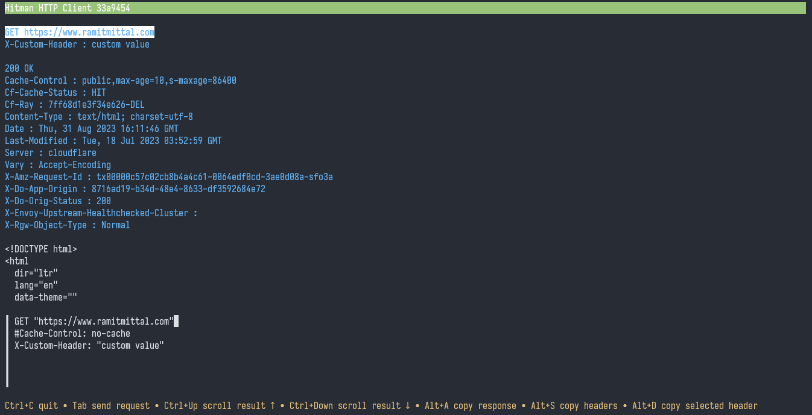

# hitman

A TUI HTTP client for debugging request/response headers inspired by [restclient.el](https://github.com/pashky/restclient.el) and [httpie](https://github.com/httpie/httpie).

## Features

* You choose the HTTP method and URL for the request *(obviously)*.
* Request + response are printed in a scrollable viewport.
* Your input is auto-saved on exit.

## Install
Using [go](https://golang.org/):
```
$ go install github.com/ramitmittal/hitman/cmd/hitman@latest
$ hitman
```
Or download a [binary package](https://github.com/ramitmittal/hitman/releases/latest).

## Usage
* Type a request definition and press `TAB` to send.
```
GET jsonplaceholder.typicode.com/posts/2
Accept: application/json
```
* Use `#` to comment lines in input.
```
GET jsonplaceholder.typicode.com/posts/2
# an http request
```
* Use `"` for escaping spaces and colons.
```
GET "https://jsonplaceholder.typicode.com/posts/2"
Accept: "custom:value with spaces and colons"
```
* Use flags to modify the HTTP client. Flags should be placed after headers.
```
GET "https://jsonplaceholder.typicode.com/posts/2"
Accept: application/json
-insecure
```
* Use `Ctrl+Up` and `Ctrl+Down` to scroll and select a header.
* Use `Alt+A`, `Alt+S`, or `Alt+D` to copy the response to clipboard.



## Supported Flags
* `-insecure`  
    Skip SSL cert checks.
* `-location`  
    Follow redirects.

## What's planned
* Releases.
* Something to do with request bodies.

## Meta
Issues + PRs are welcome!
